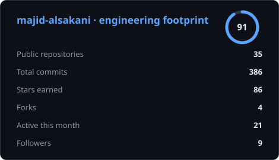
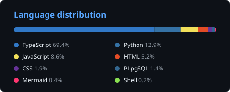

<p align="center">
  
</p>

<h1 align="center">
   
  Majid Al-Sakani | ماجد السكني 👨‍💻
</h1>

<h3 align="center">Full Stack Developer — Python, FastAPI, Django, React | Yemen</h3>

<p align="center">
  <em>Backend Engineer · API Architect · Automation & AI Bots Specialist · مطور ويب متكامل من اليمن</em>
</p>

<p align="center">
  <a href="https://github.com/majid-alsakani?tab=followers">
    
  </a>
  <a href="https://github.com/majid-alsakani?tab=repositories">
    
  </a>
  <a href="https://github.com/majid-alsakani">
    
  </a>
</p>

<p align="center">
  <a href="https://github.com/majid-alsakani?tab=repositories&sort=stargazers">
    
  </a>
  <a href="https://github.com/majid-alsakani?tab=followers">
    
  </a>
  <a href="https://github.com/majid-alsakani?tab=repositories">
    
  </a>
  <a href="https://github.com/majid-alsakani/majid-alsakani/commits/main">
    
  </a>
</p>

<p align="center">
  
</p>

<p align="center">
  
</p>

<p align="center">
  <a href="mailto:majidalsakani@gmail.com">
    
  </a>
  <a href="https://github.com/majid-alsakani">
    
  </a>
  <a href="https://www.linkedin.com/in/majid-alsakani">
    
  </a>
  <a href="https://joobea.com">
    
  </a>
</p>

<p align="center">
  
</p>

<p align="center">
  
</p>

---

## 🚀 Professional Summary / نبذة احترافية

أنا مطور برمجيات متكامل (Full Stack Developer) بخبرة متقدمة في تطوير الواجهات الخلفية (Backend Development) باستخدام **Python**، وتصميم بنى واجهات برمجة التطبيقات (API Architecture)، وبناء أنظمة الأتمتة، وتطوير بوتات تيليجرام الذكية. أمتلك القدرة على تصميم وبناء حلول برمجية قابلة للتوسع، موثوقة، وجاهزة للإنتاج، مع تركيز قوي على الأداء، البنية النظيفة، وسهولة الصيانة. كما أن لدي خبرة في تطوير الواجهات الأمامية باستخدام **TypeScript** وتقنيات الويب الحديثة، مما يمكنني من تقديم حلول برمجية شاملة ومتكاملة.

I am Majid Al-Sakani, an advanced Full Stack Developer specializing in backend development, automation systems, and API architecture using Python and modern technologies. I design and build scalable, reliable, and production-ready software solutions with a strong focus on performance, clean architecture, and maintainability. Experienced in developing intelligent Telegram bot platforms, workflow automation systems, and web applications that solve real business problems.

> 💼 **Open to opportunities:** Remote roles, freelance projects & long-term collaboration — Backend / Full Stack / API & Automation.
> 📩 Reach me at **majidalsakani@gmail.com**

---

## 🧬 Developer Card / بطاقة المطوّر

```yaml
name: Majid Al-Sakani            # ماجد السكني
located_in: Sana'a, Yemen        # صنعاء، اليمن
availability: Remote worldwide   # متاح عن بُعد لكل العالم
role: Full Stack Software Engineer
focus: ["Backend Architecture", "AI Agents", "Automation Platforms"]
company: Joobea (Founder)        # مؤسس منصة جوبيا
languages_spoken: ["Arabic (native)", "English (professional)"]

stack:
  backend:  ["Python", "FastAPI", "Django", "Flask", "Node.js"]
  frontend: ["React", "Next.js", "TypeScript", "TailwindCSS"]
  data:     ["PostgreSQL", "MySQL", "MongoDB", "Redis"]
  devops:   ["Docker", "Nginx", "GitHub Actions", "Linux", "VPS/Cloud"]
  ai:       ["LLM Agents", "RAG", "Prompt Engineering", "Automation Pipelines"]

flagship_products:
  - ["Joobea", "AI recruitment platform fighting unemployment in Yemen", "joobea.com"]
  - ["Sini Al-Khafif", "AI Chinese learning (HSK 1-6) for Arabic speakers", "sinialkhafifapp.com"]
  - ["Omni Agent AI", "Planner / Executor / Critic agent runtime with SSE streaming"]
  - ["Profile Engine", "Zero-dependency Python analytics engine powering this README"]

engineering_principles: ["Clean Architecture", "Test-Driven", "Automation-First",
                         "Security by default", "Docs as a deliverable"]
currently_building: ["Autonomous AI agents", "Scalable SaaS for the MENA region"]
open_to: ["Freelance projects", "Remote contracts", "Technical partnerships"]
contact: majidalsakani@gmail.com
```

---

## 🧭 Quick Navigation / تنقّل سريع

| 🔎 | Section / القسم | |
| :--- | :--- | :--- |
| 🚀 | [Professional Summary / نبذة احترافية](#-professional-summary--نبذة-احترافية) | من أنا وماذا أقدّم |
| 🧬 | [Developer Card / بطاقة المطوّر](#-developer-card--بطاقة-المطوّر) | الستاك والمنتجات باختصار |
| 🛠️ | [Core Expertise / الخبرات الأساسية](#️-core-expertise--الخبرات-الأساسية) | اللغات والأطر والأدوات |
| ✨ | [Featured Projects / مشاريع مختارة](#-featured-projects--مشاريع-مختارة) | المنتجات الحقيقية |
| 🎁 | [Live Open Source Metrics / مقاييس حيّة](#-open-source-projects--live-metrics--مقاييس-حيّة-للمشاريع-مفتوحة-المصدر) | أرقام تُحدَّث لحظيًا |
| 📊 | [GitHub Stats / الإحصائيات](#-github-interactive-stats--إحصائيات-تفاعلية) | رسوم بيانية تفاعلية |
| ⚡ | [Recent Activity / آخر نشاط](#-recent-activity--آخر-نشاط-برمجي) | مُحدَّث آليًا كل 6 ساعات |
| ✍️ | [Writing / كتابات](#-writing--knowledge-sharing--كتابات-ومشاركة-المعرفة) | تقارير ودراسات حالة |
| 🧩 | [Services / الخدمات](#-services-i-offer--الخدمات-التي-أقدمها) | ما يمكنني تنفيذه لك |
| 📈 | [Engineering Approach / المنهجية](#-engineering-approach--منهجية-الهندسة-البرمجية) | كيف أبني الأنظمة |
| 📬 | [Contact / تواصل](#-contact--تواصل-معي) | ابدأ مشروعك معي |
| 🌍 | [Where to find me / أين تجدني](#-where-to-find-me--أين-تجدني) | روابط رسمية |
| 🔎 | [Keywords / كلمات مفتاحية](#-keywords--كلمات-مفتاحية) | فهرسة البحث |

---

## 🛠️ Core Expertise / الخبرات الأساسية

<p align="center">
  
</p>

| الفئة | المهارات |
| :--- | :--- |
| **لغات البرمجة** | Python, TypeScript, JavaScript |
| **أطر عمل الواجهة الخلفية** | Django, FastAPI, Flask, Node.js (Express) |
| **أطر عمل الواجهة الأمامية** | React, Next.js, HTML5, CSS3, TailwindCSS |
| **قواعد البيانات** | PostgreSQL, MySQL, MongoDB |
| **أدوات التطوير** | Git, Docker, Redis |
| **الأتمتة والذكاء الاصطناعي** | Telegram API, Workflow Automation, AI/ML Concepts |
| **البنية والنشر** | REST API Design, JWT Auth, CI/CD, Nginx, VPS & Cloud Deployment |
| **الجودة** | Clean Architecture, Testing, Code Review, Performance Tuning |

<p align="center">
  
  
  
  
  
  
  
  
  
  
  
</p>

<p align="center">
  
  
  
</p>

---

## 🛠️ My Favorite Tools / أدواتي المفضلة

> كل شارة قابلة للنقر — تفتح مباشرة الكود الحقيقي المكتوب بهذه التقنية داخل حسابي.
> Every badge is clickable and opens the real code written with that technology.

### 👨‍💻 Programming and Markup Languages / لغات البرمجة والترميز

[](https://github.com/search?q=user%3Amajid-alsakani+language%3Apython)[](https://github.com/search?q=user%3Amajid-alsakani+language%3Atypescript)[](https://github.com/search?q=user%3Amajid-alsakani+language%3Ajavascript)[](https://github.com/search?q=user%3Amajid-alsakani+language%3Ahtml)[](https://github.com/search?q=user%3Amajid-alsakani+language%3Acss)[](https://github.com/search?q=user%3Amajid-alsakani+language%3Asql)[](https://github.com/search?q=user%3Amajid-alsakani+language%3Ashell)[](https://github.com/search?q=user%3Amajid-alsakani+language%3Amarkdown)[](https://github.com/search?q=user%3Amajid-alsakani+language%3Ayaml)[](https://github.com/search?q=user%3Amajid-alsakani+language%3Ajson)[](https://github.com/search?q=user%3Amajid-alsakani+language%3Adockerfile)

### 🧰 Frameworks and Libraries / أطر العمل والمكتبات

[](https://github.com/majid-alsakani?tab=repositories)[](https://github.com/majid-alsakani?tab=repositories)[](https://github.com/majid-alsakani?tab=repositories)[](https://github.com/majid-alsakani?tab=repositories)[](https://github.com/majid-alsakani?tab=repositories)[](https://github.com/majid-alsakani?tab=repositories)[](https://github.com/majid-alsakani?tab=repositories)[](https://github.com/majid-alsakani?tab=repositories)[](https://github.com/majid-alsakani?tab=repositories)[](https://github.com/majid-alsakani?tab=repositories)[](https://github.com/majid-alsakani?tab=repositories)[](https://github.com/majid-alsakani?tab=repositories)[](https://github.com/majid-alsakani?tab=repositories)[](https://github.com/majid-alsakani?tab=repositories)[](https://github.com/majid-alsakani?tab=repositories)[](https://github.com/majid-alsakani?tab=repositories)

### 🗄️ Databases and Cloud Hosting / قواعد البيانات والاستضافة السحابية

[](https://github.com/majid-alsakani?tab=repositories)[](https://github.com/majid-alsakani?tab=repositories)[](https://github.com/majid-alsakani?tab=repositories)[](https://github.com/majid-alsakani?tab=repositories)[](https://github.com/majid-alsakani?tab=repositories)[](https://github.com/majid-alsakani?tab=repositories)[](https://github.com/majid-alsakani?tab=repositories)[](https://github.com/majid-alsakani?tab=repositories)[](https://github.com/majid-alsakani?tab=repositories)[](https://github.com/majid-alsakani?tab=repositories)[](https://github.com/majid-alsakani?tab=repositories)[](https://github.com/majid-alsakani?tab=repositories)

### 💻 Software and Tools / البرمجيات والأدوات

[](https://github.com/majid-alsakani?tab=repositories)[](https://github.com/majid-alsakani?tab=repositories)[](https://github.com/majid-alsakani?tab=repositories)[](https://github.com/majid-alsakani?tab=repositories)[](https://github.com/majid-alsakani?tab=repositories)[](https://github.com/majid-alsakani?tab=repositories)[](https://github.com/majid-alsakani?tab=repositories)[](https://github.com/majid-alsakani?tab=repositories)[](https://github.com/majid-alsakani?tab=repositories)[](https://github.com/majid-alsakani?tab=repositories)[](https://github.com/majid-alsakani?tab=repositories)[](https://github.com/majid-alsakani?tab=repositories)[](https://github.com/majid-alsakani?tab=repositories)[](https://github.com/majid-alsakani?tab=repositories)

---

## ✨ Featured Projects / مشاريع مختارة

| # | Project / المشروع | Description | Tech Stack | Links |
| :-- | :--- | :--- | :--- | :--- |
| 🎓 | **Sini Al-Khafif / صيني عالخفيف** | AI-powered Chinese (HSK 1–6) learning platform for Arabic speakers | Python · FastAPI · React · AI | [Live](https://sinialkhafifapp.com) · [Repo](https://github.com/majid-alsakani/sini-alkhafif-app) |
| 💼 | **Joobea / جوبيا** | Smart recruitment platform for Yemen with intelligent matching | Django · PostgreSQL · React | [Live](https://joobea.com) · [Repo](https://github.com/majid-alsakani/joobea-platform) |
| 🚀 | **Enterprise Backend System** | Production-grade REST API, JWT auth, auto docs, clean architecture | FastAPI · PostgreSQL · Docker | [Repo](https://github.com/majid-alsakani/enterprise-backend-system) |
| 🏨 | **Hotel Website (bsafina)** | Full production hotel website with booking & management | Python · Web | Repo & new domain — *site temporarily offline* |
| 🤖 | **Telegram Automation Platforms** | Business workflow automation bots | Python · Telegram Bot API | [Repos](https://github.com/majid-alsakani?tab=repositories) |

### 🎓 صيني عالخفيف | Sini Al-Khafif - AI-Powered Language Learning
- **Description:** An advanced AI-powered platform for Arabic speakers to learn Chinese (HSK 1-6), featuring adaptive learning, real-life context, and 5-skill integration.
- **Live Demo:** [https://sinialkhafifapp.com](https://sinialkhafifapp.com)
- **Showcase Repository:** [https://github.com/majid-alsakani/sini-alkhafif-app](https://github.com/majid-alsakani/sini-alkhafif-app)

---

### 💼 جوبيا | Joobea - Smart Recruitment Platform
- **Description:** A comprehensive, intelligent recruitment platform for Yemen, designed to connect job seekers with opportunities through smart matching and enterprise-grade management.
- **Live Demo:** [https://joobea.com](https://joobea.com)
- **Showcase Repository:** [https://github.com/majid-alsakani/joobea-platform](https://github.com/majid-alsakani/joobea-platform)

---

### 🚀 Enterprise Backend System / نظام خلفي للمؤسسات
- **Description:** A high-performance, production-ready backend API built with FastAPI, showcasing advanced architecture, JWT authentication, and automated documentation.
- **Repository:** [https://github.com/majid-alsakani/enterprise-backend-system](https://github.com/majid-alsakani/enterprise-backend-system)

---

### 🏨 Hotel Website - Production System / موقع فندق - نظام إنتاجي
- Full production-ready hotel website with booking and management functionality.
- Live project: `https://bsafina.com` — ⚠️ *الموقع متوقف مؤقتًا حاليًا / temporarily offline (domain being renewed).*
- 📩 للاطلاع على لقطات الشاشة أو نسخة تجريبية: [majidalsakani@gmail.com](mailto:majidalsakani@gmail.com)

---

### 🤖 Telegram Automation Platforms / منصات أتمتة تيليجرام
- Advanced automation bots designed for business workflow optimization using Python and Telegram API.
- [Browse all repositories →](https://github.com/majid-alsakani?tab=repositories)

---

## 🎁 Open Source Projects — Live Metrics / مقاييس حيّة للمشاريع مفتوحة المصدر

> كل الأرقام في الجدول تُحدَّث تلقائيًا مباشرة من GitHub في كل مرة يُفتح فيها هذا الملف.
> Every number below is fetched live from GitHub on each page view — no manual updates.

| **🎁 Project / المشروع** | **⭐ Stars** | **🍴 Forks** | **🛎 Issues** | **📬 Pull Requests** | **🕒 Last Commit** |
| :--- | :--- | :--- | :--- | :--- | :--- |
| [**Joobea — Smart Recruitment Platform**](https://github.com/majid-alsakani/joobea-platform) |  |  |  |  |  |
| [**Sini Al-Khafif — AI Language Learning**](https://github.com/majid-alsakani/sini-alkhafif-app) |  |  |  |  |  |
| [**Omni Agent AI — Autonomous Agent Engine**](https://github.com/majid-alsakani/omni-agent-ai) |  |  |  |  |  |
| [**Enterprise Backend System — FastAPI**](https://github.com/majid-alsakani/enterprise-backend-system) |  |  |  |  |  |
| [**Profile Engine — Self-Updating Analytics**](https://github.com/majid-alsakani/majid-alsakani) |  |  |  |  |  |

<p align="center">
  
  
  
  
</p>

---

## 📊 GitHub Interactive Stats / إحصائيات تفاعلية

<p align="center">
  
  
</p>

<p align="center">
  
</p>

<p align="center">
  
</p>

<p align="center">
  
</p>

### 🌗 Theme-Aware Advanced Stats / إحصائيات متقدمة تتكيّف مع وضع العرض

<div align="center">

<picture>
  <source media="(prefers-color-scheme: dark)" srcset="https://github-readme-stats-fast.vercel.app/api?username=majid-alsakani&show_icons=true&include_all_commits=true&count_private=true&hide_border=true&number_format=long&rank_icon=percentile&show=reviews,prs_merged,prs_merged_percentage,discussions_started,discussions_answered&icon_color=2d77dc&title_color=2d77dc&text_color=ffffff&bg_color=0d1117&disable_animations=true">
  <source media="(prefers-color-scheme: light)" srcset="https://github-readme-stats-fast.vercel.app/api?username=majid-alsakani&show_icons=true&include_all_commits=true&count_private=true&hide_border=true&number_format=long&rank_icon=percentile&show=reviews,prs_merged,prs_merged_percentage,discussions_started,discussions_answered&disable_animations=true">
  
</picture>
<picture>
  <source media="(prefers-color-scheme: dark)" srcset="https://github-readme-stats-fast.vercel.app/api/top-langs/?username=majid-alsakani&layout=donut&langs_count=10&size_weight=0.5&count_weight=0.5&hide_border=true&custom_title=Language%20distribution%20across%20my%20repos&icon_color=2d77dc&title_color=2d77dc&text_color=ffffff&bg_color=0d1117&disable_animations=true">
  <source media="(prefers-color-scheme: light)" srcset="https://github-readme-stats-fast.vercel.app/api/top-langs/?username=majid-alsakani&layout=donut&langs_count=10&size_weight=0.5&count_weight=0.5&hide_border=true&custom_title=Language%20distribution%20across%20my%20repos&disable_animations=true">
  
</picture>

<picture>
  <source media="(prefers-color-scheme: dark)" srcset="https://streak-stats.demolab.com?user=majid-alsakani&type=svg&hide_border=true&background=0d1117&fire=2d77dc&ring=2d77dc&currStreakLabel=2d77dc&currStreakNum=ffffff&sideNums=ffffff&sideLabels=ffffff&dates=8b949e">
  <source media="(prefers-color-scheme: light)" srcset="https://streak-stats.demolab.com?user=majid-alsakani&type=svg&hide_border=true">
  
</picture>

</div>

### 📌 Pinned Repository Cards / بطاقات المشاريع المثبتة

<div align="center">

<a href="https://github.com/majid-alsakani/joobea-platform">
  <picture>
    <source media="(prefers-color-scheme: dark)" srcset="https://github-readme-stats-fast.vercel.app/api/pin/?username=majid-alsakani&repo=joobea-platform&hide_border=true&show_owner=true&icon_color=2d77dc&title_color=2d77dc&text_color=ffffff&bg_color=0d1117">
    <source media="(prefers-color-scheme: light)" srcset="https://github-readme-stats-fast.vercel.app/api/pin/?username=majid-alsakani&repo=joobea-platform&hide_border=true&show_owner=true">
    
  </picture>
</a>
<a href="https://github.com/majid-alsakani/sini-alkhafif-app">
  <picture>
    <source media="(prefers-color-scheme: dark)" srcset="https://github-readme-stats-fast.vercel.app/api/pin/?username=majid-alsakani&repo=sini-alkhafif-app&hide_border=true&show_owner=true&icon_color=2d77dc&title_color=2d77dc&text_color=ffffff&bg_color=0d1117">
    <source media="(prefers-color-scheme: light)" srcset="https://github-readme-stats-fast.vercel.app/api/pin/?username=majid-alsakani&repo=sini-alkhafif-app&hide_border=true&show_owner=true">
    
  </picture>
</a>
<a href="https://github.com/majid-alsakani/majid-alsakani">
  <picture>
    <source media="(prefers-color-scheme: dark)" srcset="https://github-readme-stats-fast.vercel.app/api/pin/?username=majid-alsakani&repo=majid-alsakani&hide_border=true&show_owner=true&icon_color=2d77dc&title_color=2d77dc&text_color=ffffff&bg_color=0d1117">
    <source media="(prefers-color-scheme: light)" srcset="https://github-readme-stats-fast.vercel.app/api/pin/?username=majid-alsakani&repo=majid-alsakani&hide_border=true&show_owner=true">
    
  </picture>
</a>
<a href="https://github.com/majid-alsakani/majid-portfolio">
  <picture>
    <source media="(prefers-color-scheme: dark)" srcset="https://github-readme-stats-fast.vercel.app/api/pin/?username=majid-alsakani&repo=majid-portfolio&hide_border=true&show_owner=true&icon_color=2d77dc&title_color=2d77dc&text_color=ffffff&bg_color=0d1117">
    <source media="(prefers-color-scheme: light)" srcset="https://github-readme-stats-fast.vercel.app/api/pin/?username=majid-alsakani&repo=majid-portfolio&hide_border=true&show_owner=true">
    
  </picture>
</a>

</div>

### 📉 Contribution Activity Graph / منحنى النشاط البرمجي

<div align="center">

<picture>
  <source media="(prefers-color-scheme: dark)" srcset="https://github-readme-activity-graph.vercel.app/graph?username=majid-alsakani&theme=github-dark&hide_border=true&area=true&custom_title=Contribution%20activity%20of%20Majid%20Al-Sakani">
  <source media="(prefers-color-scheme: light)" srcset="https://github-readme-activity-graph.vercel.app/graph?username=majid-alsakani&theme=github-light&hide_border=true&area=true&custom_title=Contribution%20activity%20of%20Majid%20Al-Sakani">
  
</picture>

</div>

### 🐍 Contribution Snake / أفعى المساهمات

<div align="center">

<picture>
  <source media="(prefers-color-scheme: dark)" srcset="https://raw.githubusercontent.com/majid-alsakani/majid-alsakani/output/github-contribution-grid-snake-dark.svg">
  <source media="(prefers-color-scheme: light)" srcset="https://raw.githubusercontent.com/majid-alsakani/majid-alsakani/output/github-contribution-grid-snake.svg">
  
</picture>

<sub>يُولَّد تلقائيًا كل 12 ساعة عبر GitHub Actions من مساهماتي الحقيقية.</sub>

</div>

### 🧊 3D Contribution Calendar / تقويم المساهمات ثلاثي الأبعاد

<div align="center">

<picture>
  <source media="(prefers-color-scheme: dark)" srcset="https://raw.githubusercontent.com/majid-alsakani/majid-alsakani/main/profile-3d-contrib/night-view.svg">
  <source media="(prefers-color-scheme: light)" srcset="https://raw.githubusercontent.com/majid-alsakani/majid-alsakani/main/profile-3d-contrib/day-green.svg">
  
</picture>

</div>

### 🔥 Streak Stats / سلسلة الالتزام اليومي

<div align="center">

<picture>
  <source media="(prefers-color-scheme: dark)" srcset="https://streak-stats.demolab.com?user=majid-alsakani&theme=monokai-metallian&hide_border=true&date_format=M%20j%5B%2C%20Y%5D">
  <source media="(prefers-color-scheme: light)" srcset="https://streak-stats.demolab.com?user=majid-alsakani&theme=default&hide_border=true&date_format=M%20j%5B%2C%20Y%5D">
  
</picture>

</div>

### 🏅 GitHub Achievements & Open Source / الإنجازات والمساهمات مفتوحة المصدر

<p align="center">
  <a href="https://github.com/majid-alsakani?tab=achievements"></a>
  <a href="https://github.com/majid-alsakani?tab=repositories&sort=stargazers"></a>
  <a href="https://github.com/majid-alsakani?tab=stars"></a>
  <a href="https://github.com/majid-alsakani?tab=followers"></a>
  <a href="https://github.com/sponsors/majid-alsakani"></a>
</p>

<p align="center">
  <sub>
    Open-source engineer from Yemen 🇾🇪 · production systems in <b>Python · FastAPI · Django · React · TypeScript</b> ·
    building <a href="https://joobea.com">Joobea</a> (recruitment) and <a href="https://sinialkhafifapp.com">Sini Al-Khafif</a> (EdTech) ·
    author of the <a href="https://github.com/majid-alsakani/majid-alsakani/tree/main/tools/profile-engine">Profile Engine</a> analytics pipeline.
  </sub>
</p>

---

## ⚡ Recent Activity / آخر نشاط برمجي

> يُحدَّث تلقائيًا كل 6 ساعات عبر GitHub Actions — نشاط حقيقي مباشر من حسابي.

<!--START_SECTION:activity-->
<!-- سيتم تعبئة هذا القسم تلقائيًا بأحدث الـ commits و PRs و Issues خلال أول تشغيل للـ workflow -->
<!--END_SECTION:activity-->

---

## ✍️ Writing & Knowledge Sharing / كتابات ومشاركة المعرفة

- [**🔥 How I built a self-updating GitHub profile with a pure-Python analytics engine**](https://majid-alsakani.github.io/majid-alsakani/)
  _Zero dependencies, GraphQL caching, circuit breaker, SVG rendering — full interactive report._
- [**🔥 Joobea — solving unemployment in Yemen with AI-driven job matching**](https://github.com/majid-alsakani/joobea-platform)
  _Product story, architecture diagrams and a live product tour._
- [**🔥 Sini Al-Khafif — teaching Chinese (HSK 1–6) to Arabic speakers with adaptive AI**](https://github.com/majid-alsakani/sini-alkhafif-app)
  _Inside the app: real screenshots, learning engine and data model._
- [**Omni Agent AI — Planner / Executor / Critic loop with real SSE streaming**](https://github.com/majid-alsakani/omni-agent-ai)
  _A production-shaped agent runtime with a real tool registry._

---

## 🧩 Services I Offer / الخدمات التي أقدمها

| Service | الخدمة |
| :--- | :--- |
| REST API design & development (FastAPI / Django REST) | تصميم وتطوير واجهات برمجية |
| Full stack web apps (React / Next.js + Python backend) | تطبيقات ويب متكاملة |
| Telegram bots & workflow automation | بوتات تيليجرام وأتمتة العمليات |
| Database design, optimization & migration | تصميم وتحسين قواعد البيانات |
| Deployment, Docker & server setup | النشر وإعداد الخوادم |
| Code review, refactoring & performance tuning | مراجعة الكود وتحسين الأداء |

---

## 📈 Engineering Approach / منهجية الهندسة البرمجية

- **Clean Code:** Writing maintainable and readable code.
- **Scalability:** Designing systems that grow with user needs.
- **Automation-First:** Reducing manual tasks through intelligent scripts.
- **Performance:** Optimizing every line for speed and efficiency.
- **Security-Minded:** JWT auth, input validation, and least-privilege access by default.
- **Documentation:** Every API ships with clear, auto-generated docs.

---

## 📬 Contact / تواصل معي

- **Email:** [majidalsakani@gmail.com](mailto:majidalsakani@gmail.com)
- **GitHub:** [majid-alsakani](https://github.com/majid-alsakani)
- **LinkedIn:** [Majid Al-Sakani](https://www.linkedin.com/in/majid-alsakani)
- **Website:** [joobea.com](https://joobea.com)
- **Location:** Sana'a, Yemen 🇾🇪 — Available worldwide (Remote)

<p align="center">
  <a href="mailto:majidalsakani@gmail.com">
    
  </a>
</p>

---

## 🌍 Where to find me / أين تجدني

<p align="center">
  <a href="https://github.com/majid-alsakani"></a>
  <a href="https://www.linkedin.com/in/majid-alsakani"></a>
  <a href="mailto:majidalsakani@gmail.com"></a>
  <a href="https://joobea.com"></a>
  <a href="https://sinialkhafifapp.com"></a>
</p>

<p align="center">
  <em>🇾🇪 Based in Sana'a, Yemen — building for the world, remotely. / مقيم في صنعاء، اليمن — أعمل عن بُعد مع العالم كله.</em>
</p>

---

## 🔎 Keywords / كلمات مفتاحية

`Majid Al-Sakani` · `ماجد السكني` · `Majid Alsakani developer` · `Full Stack Developer Yemen` · `مبرمج يمني` · `مطور ويب اليمن` · `Python Developer` · `مطور بايثون` · `FastAPI Developer` · `Django Developer` · `Flask` · `REST API Developer` · `Backend Engineer` · `مهندس باك اند` · `React Developer` · `Next.js` · `TypeScript` · `JavaScript` · `TailwindCSS` · `PostgreSQL` · `MySQL` · `MongoDB` · `Redis` · `Docker` · `Linux` · `Nginx` · `CI/CD` · `Microservices` · `JWT Authentication` · `Web Scraping` · `Workflow Automation` · `أتمتة` · `Telegram Bot Developer` · `مطور بوتات تيليجرام` · `AI Agents` · `Chatbot Development` · `SaaS Development` · `Recruitment Platform` · `EdTech` · `HSK Chinese Learning` · `Freelance Developer` · `Remote Software Engineer` · `Hire Python Developer` · `Middle East Developer` · `Arabic Developer` · `Sana'a` · `Yemen`

---

#### Thanks for visiting
<p align="center">
  <a href="https://info.flagcounter.com/DfqZ">
    
  </a>
</p>

### Support
<p align="center">
  <a href="mailto:majidalsakani@gmail.com">
    
  </a>
  <a href="mailto:majidalsakani@gmail.com">
    
  </a>
  <a href="mailto:majidalsakani@gmail.com">
    
  </a>
</p>

### 🏷️
<p align="center">
  
</p>

<p align="center">
  ✨ <em>ملفي الشخصي هو انعكاس لرحلتي المستمرة في عالم البرمجة، يتطور وينمو مع كل تحدٍ جديد.</em> ✨
  <br>
  ✨ <em>My profile is a reflection of my continuous journey in the world of programming, evolving and growing with every new challenge.</em> ✨
</p>

<p align="center">
  
</p>

<!-- PROFILE-ENGINE:START -->
<!-- Generated by tools/profile-engine. Do not edit by hand; edits inside this block are overwritten. -->

<div align="center">




</div>

### 📊 Live engineering metrics

| Metric | Value |
| --- | --- |
| Public repositories | **11** |
| Total commits | **173** |
| Stars earned | **24** |
| Forks | **1** |
| Shipped in the last 30 days | **5** repositories |
| Contribution streak | **1** days (longest **9**) |
| Contributions this year | **101** |
| Engineering footprint score | **54/100** |

### 🧠 Language distribution

**TypeScript** 68.3% · **Python** 21.8% · **JavaScript** 7.0% · **CSS** 2.3% · **HTML** 0.4% · **Dockerfile** 0.1%

### 🔥 Commit distribution — weekday × week

<div align="center">



</div>

| Weekday | Distribution | Contributions | Share |
| --- | --- | --- | --- |
| Mon | `█████████░░░` | 23 | 22.8% |
| Tue | `███████████░` | 28 | 27.7% |
| Wed | `████████████` | 31 | 30.7% |
| Thu | `█░░░░░░░░░░░` | 2 | 2.0% |
| Fri | `░░░░░░░░░░░░` | 1 | 1.0% |
| Sat | `████░░░░░░░░` | 11 | 10.9% |
| Sun | `██░░░░░░░░░░` | 5 | 5.0% |

| Rhythm signal | Value |
| --- | --- |
| Window | `2025-07-27` → `2026-08-01` (53 weeks) |
| Days with activity | **16** (4.3% of the window) |
| Daily average | **0.27** contributions |
| Peak weekday | **Wed** · quietest **Fri** |
| Weekend share | **15.8%** |
| Busiest single day | **27** on `2026-07-29` |

### 🚀 Most active work

| Repository | Language | Commits | Stars | Last push |
| --- | --- | --- | --- | --- |
| [`joobea-platform`](https://github.com/majid-alsakani/joobea-platform) | Other | 94 | 2 | 0d ago |
| [`majid-alsakani`](https://github.com/majid-alsakani/majid-alsakani) | Python | 31 | 4 | 0d ago |
| [`sini-alkhafif-app`](https://github.com/majid-alsakani/sini-alkhafif-app) | Other | 29 | 2 | 3d ago |
| [`majid-portfolio`](https://github.com/majid-alsakani/majid-portfolio) | TypeScript | 5 | 4 | 2d ago |
| [`awesome-saudi-tech`](https://github.com/majid-alsakani/awesome-saudi-tech) | Other | 1 | 4 | 111d ago |
| [`supplyhub`](https://github.com/majid-alsakani/supplyhub) | TypeScript | 2 | 2 | 112d ago |

### 📈 Full interactive report

**[Open the live dashboard →](docs/index.html)** · machine-readable [`JSON`](docs/profile-report.json) · rebuilt on every run.

<sub>Pipeline health · cache hit rate <b>0.0%</b> (0 hit / 1 miss)</sub>

<sub>Recomputed automatically by a GitHub Actions workflow · last run <code>2026-08-01 16:48 UTC</code></sub>

<!-- PROFILE-ENGINE:END -->

<p align="center">
  <sub>♻️ This README is <strong>auto-generated and refreshed every 6 hours</strong> by my own zero-dependency <a href="https://github.com/majid-alsakani/majid-alsakani/tree/main/tools/profile-engine">Profile Engine</a> (Python · GraphQL · SVG · 66 unit tests).</sub>
  <br>
  
  
  
</p>
